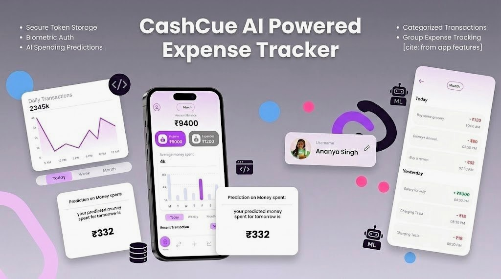
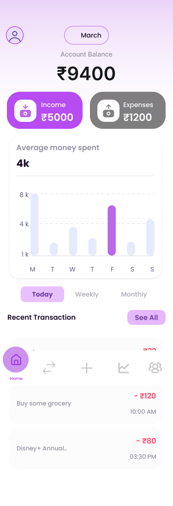
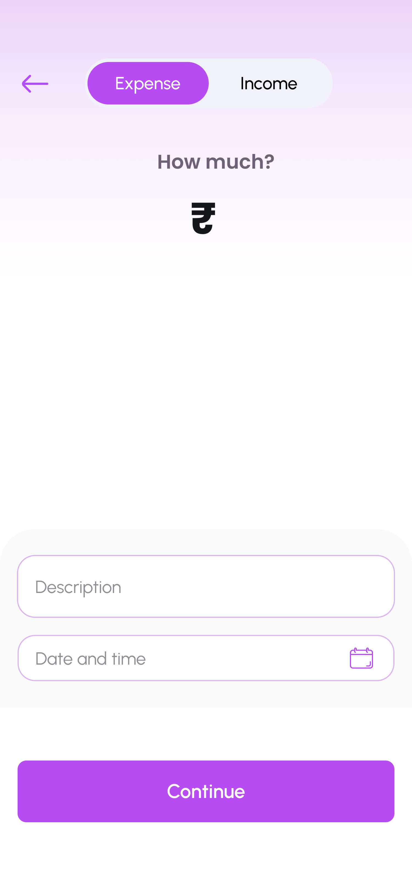
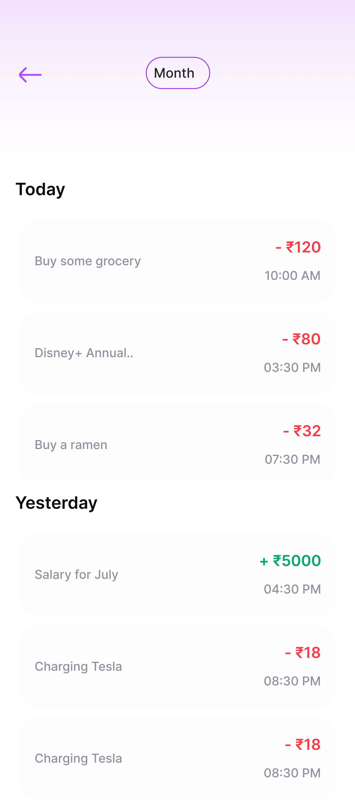
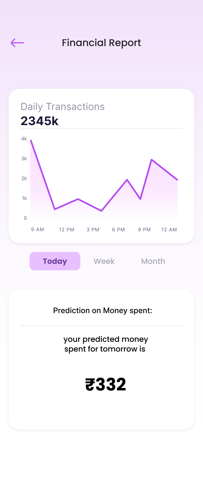
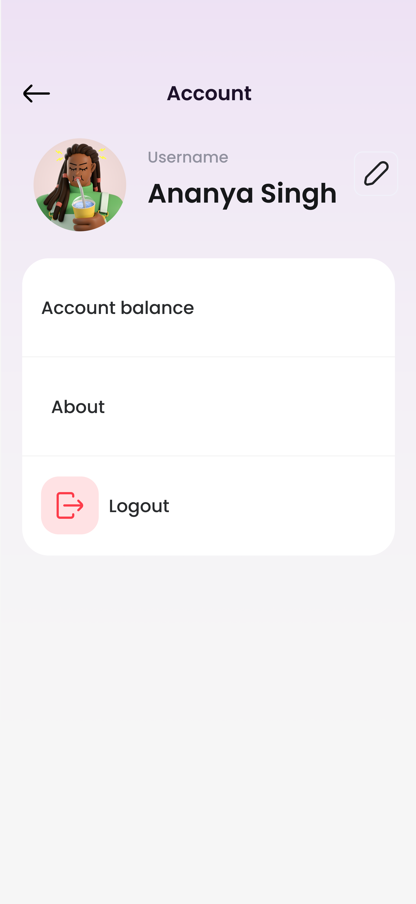

# CashCue – AI Powered Expense Tracker



**CashCue** is a secure and scalable **Flutter-based smart expense management** application designed to help users track, manage, and predict their financial behavior in real time.

Built using _GetX architecture_, Dio networking, Secure Storage, Biometric authentication, and Machine Learning-based predictions.  
✨ _Designed with usability and simplicity in mind, CashCue encourages a more mindful, active lifestyle._

---

## Download the APK
Access the latest APK for Kotlin Dictionary from the link below.

[](https://github.com/YugaJ7/CashCue/releases/download/v0.1.0/app-release-v0.1.0.apk)

---

## 🚀 Features

### 🔐 Authentication & Security

- Email & Password Login / Register
- Forgot Password Flow
- JWT-based authentication
- Secure token storage using encrypted storage
- Auto login (persistent session)
- 🔒 Biometric authentication (Fingerprint / Face Unlock)
- Dio interceptor with automatic token handling
- Clean and modular authentication service layer

---

### 💰 Expense & Transaction Management

- Add income & expense transactions
- Real-time transaction refresh
- Categorized transaction handling
- Account balance API integration
- Smart UI updates using GetX reactive state management
- Optimized transaction list rendering

---

### 📊 Analytics & Insights

- Graph-based expense visualization
- Balance tracking dashboard
- Financial summary overview
- Category-based expense breakdown
- Real-time balance updates

---

### 🤖 AI / ML Integration (Smart Financial Predictions)
CashCue integrates a lightweight Machine Learning prediction module to analyze user spending patterns and generate insights.

#### ML Capabilities:

- 📈 Monthly expense trend prediction
- 💡 Future spending estimation
- ⚠️ Overspending risk detection
- 📊 Pattern analysis based on transaction history

The ML layer processes transaction history and predicts upcoming financial trends, helping users make smarter budgeting decisions.

--- 

### 👥 Groups Feature

- Group-based expense tracking
- Dedicated groups screen
- Organized financial segregation
- Group detail view
- Clean group UI components

---

## 🏗️ Architecture

CashCue follows a clean and scalable layered architecture:

### 🧩 Presentation Layer

- Screens
- Reusable widgets
- Navbar components

### 🧠 Controller Layer

- GetX controllers
- Reactive state management
- Dependency injection via bindings

### 🔌 Service Layer

- API Services
- Auth Service
- Dio Client with interceptors

### 🛠️ Utility Layer

- Secure storage
- Validators
- Helper utilities

### 🌐 Network Layer

- Centralized Dio client
- Token injection
- Error handling

---

## 📂 Project Structure

```
lib/
│── main.dart
│
├── bindings/
│   └── auth_bindings.dart
│
├── components/
│   ├── navbar/
│   ├── style/
│   └── widgets/
│
├── constants/
│
├── controller/
│
├── screen/
│
├── services/
│   ├── api_services.dart
│   ├── auth_service.dart
│   └── dio_client.dart
│
├── utils/
│   ├── secure_storage.dart
│   └── validator.dart
│
├── widgets/
│   ├── date_time.dart
│   ├── groupdetail.dart
│   ├── tabButton.dart
│   ├── text.dart
│   ├── toggle_button.dart
│   └── transaction_list.dart
```

## 📸 App Screenshots

<p>


  
  





</p>

---

## 🛠️ Installation

```bash
git clone https://github.com/YugaJ7/CashCue.git
cd cashcue
flutter pub get
flutter run
```

---

## 📦 Build & Deploy

### Android

```
flutter build apk --release
# or
flutter build appbundle --release
```

### iOS

```
flutter build ios --release
```


## 🤝 Contributions & Credits

This project is developed and maintained by [Yuga Jaiswal](https://github.com/YugaJ7).  
Feel free to fork, contribute, or give feedback!

---

## 📩 Feedback

If you have any ideas, feature requests, or spot a bug, feel free to open an issue or connect via [LinkedIn](https://linkedin.com/in/yuga-jaiswal).
